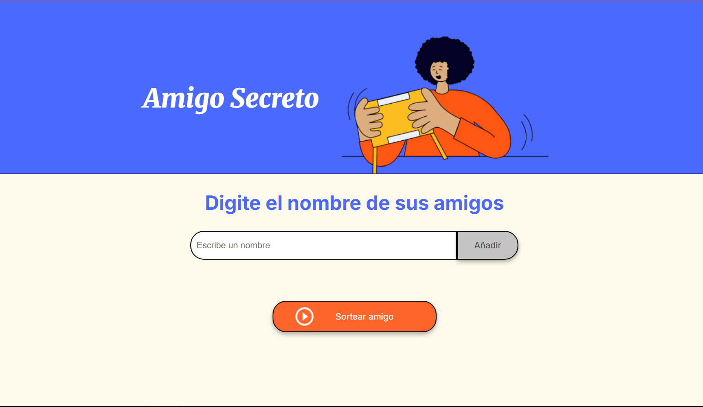

# 🎁 Challenge Amigo Secreto

 <!-- Cambia esta ruta si usas otra imagen -->

---

## 🏅 Insignias


---

## 📚 Índice

- [📌 Descripción del Proyecto](#-descripción-del-proyecto)
- [🚧 Estado del Proyecto](#-estado-del-proyecto)
- [🎮 Demostración](#-demostración-de-funciones-y-aplicaciones)
- [🔗 Acceso al Proyecto](#-acceso-al-proyecto)
- [🛠️ Tecnologías Utilizadas](#-tecnologías-utilizadas)
- [🤝 Personas Contribuyentes](#-personas-contribuyentes)
- [👨‍💻 Personas Desarrolladoras](#-personas-desarrolladoras-del-proyecto)
- [📄 Licencia](#-licencia)

---

## 📌 Descripción del Proyecto

Este proyecto fue desarrollado como parte del programa **Oracle ONE Next Education** en colaboración con **Alura Latam**, con el objetivo de fortalecer habilidades en **JavaScript** y manipulación del DOM.

Para organizar el flujo de trabajo, seguí paso a paso las tarjetas didácticas en **Trello** proporcionadas por Alura, que guiaron la lógica, validaciones y estructura del proyecto.

**Amigo Secreto** es una aplicación interactiva que permite agregar nombres de amigos a una lista y realizar un sorteo aleatorio para elegir a uno como el "amigo secreto".

---

## 🚧 Estado del Proyecto

✅ Finalizado  
🧪 Posibles mejoras: validación más avanzada, animaciones de sorteo, almacenamiento local con `localStorage` entre otras.

---

## 🎮 Demostración de Funciones y Aplicaciones

- ✅ Agregar nombres por medio de un campo de texto.
- ✅ Evitar duplicados o campos vacíos mediante validaciones.
- ✅ Visualizar los nombres ingresados.
- ✅ Realizar un sorteo aleatorio con resultado visible.

---

## 🔗 Acceso al Proyecto 
📂 O clona este repositorio:
```bash
git clone https://github.com/tuusuario/amigo-secreto.git
```
---

## 🛠️ Tecnologías Utilizadas

- HTML5 para la estructura
- CSS3 para los estilos básicos
- JavaScript para la lógica del sorteo
- DOM API para interacción con el usuario
- Trello para la gestión del proyecto mediante plantilla didáctica proporcionada por Alura

---

## 🤝 Personas Contribuyentes

Projecto base (html, css e index html) proporcionado por alura.

---

## 👨‍💻 Personas Desarrolladoras
Mario Murillo
Técnico Universitario en Desarrollo de Aplicaciones Web  
🌐 [GitHub](https://github.com/MarioMurillo2022)  
📍 Honduras
